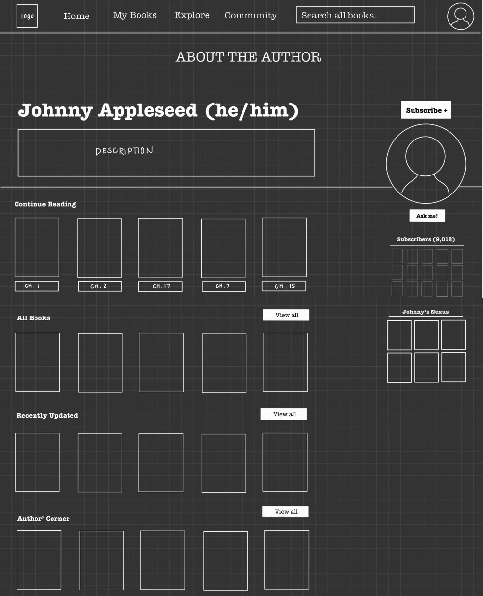
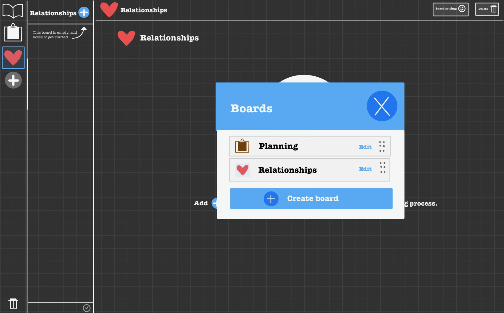
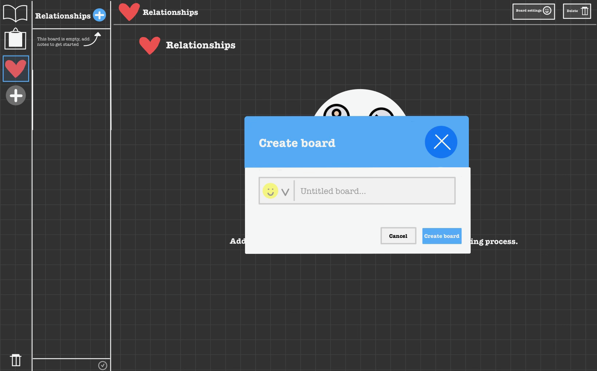
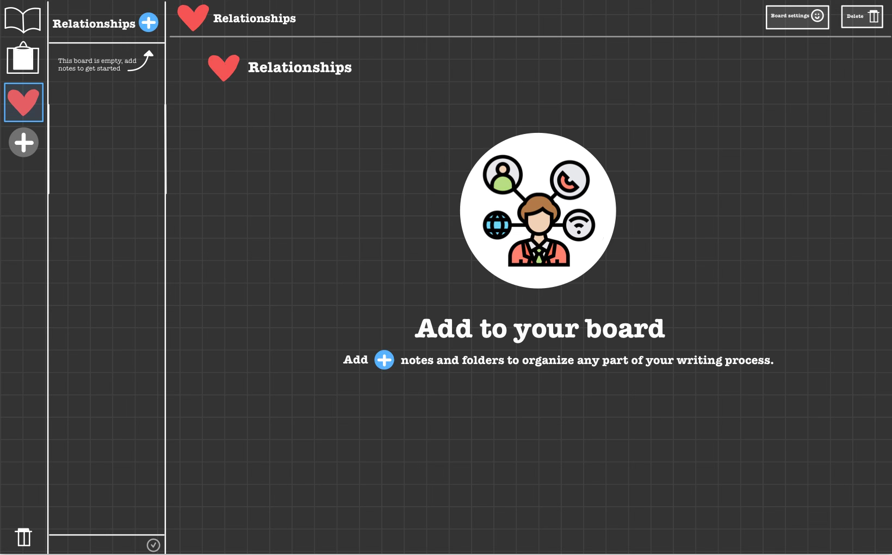
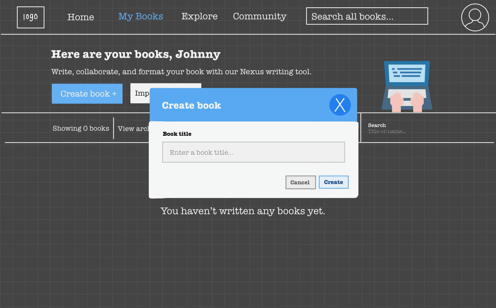
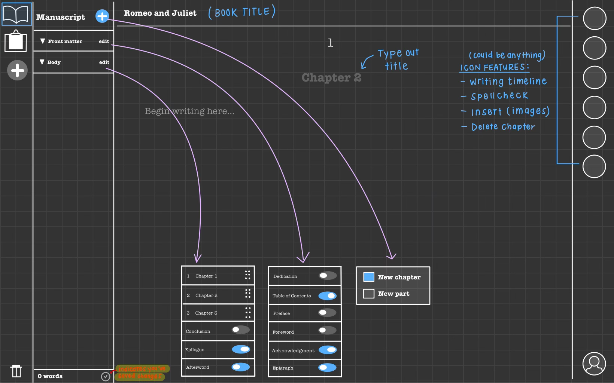
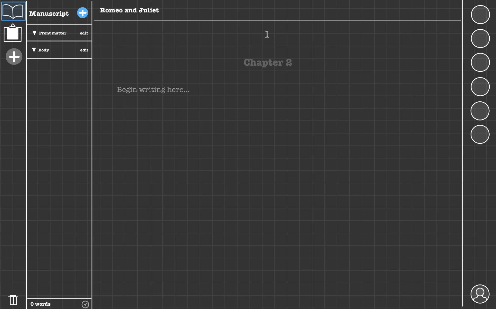
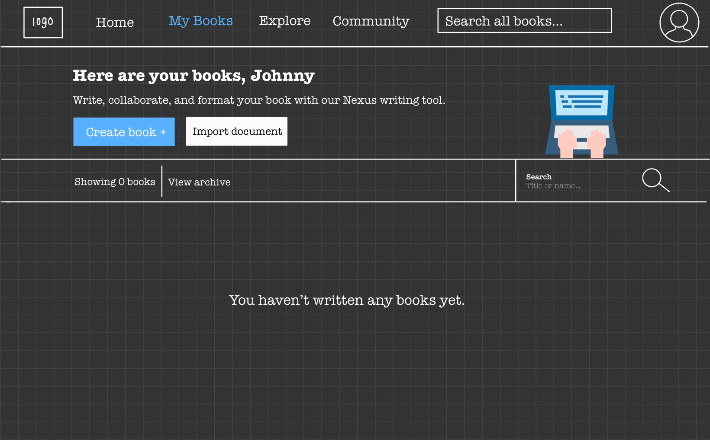
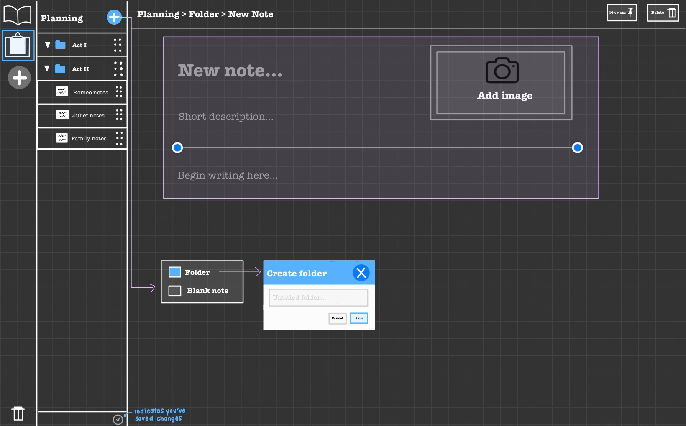
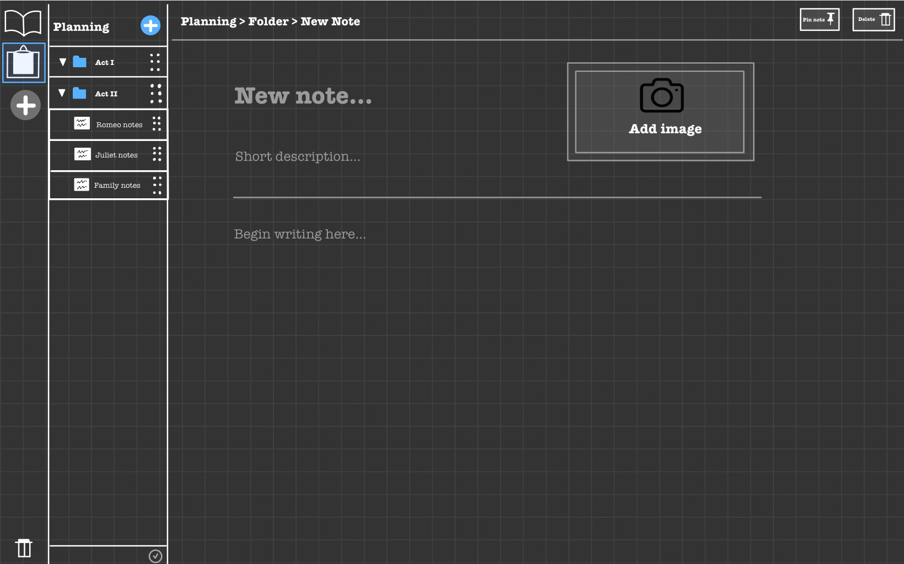

# Novel Nexus Graphical Human Interface

## Home Page

The Novel Nexus home page is the first page visitors arrive at on the website. It provides an overview of the platform and offers links to various sections and features.

## Author's Page

The Author's Page allows authors to manage their profiles, including their biography, avatar, and personal information.

## Board Edits

The Board Edits page is where authors can view and manage edits to their manuscripts.

## Board Edits 2

An extension of the Board Edits page, providing additional functionality for managing manuscript edits.

## Board View

The Board View displays an author's manuscript board, providing an overview of their work.

## Create Book

Authors can use the Create Book page to start the process of adding a new book to Novel Nexus.

## Manuscript Functions

The Manuscript Functions page offers a set of tools and functions for authors to manage their manuscripts.

## Manuscript View

Authors can view and edit their manuscripts using the Manuscript View page.

## My Books

The My Books page allows authors to view and manage their published books.

## Planning Functions

Authors can plan and organize their writing projects using the Planning Functions page.

## Planning View

The Planning View provides an interface for authors to plan and structure their writing projects.

